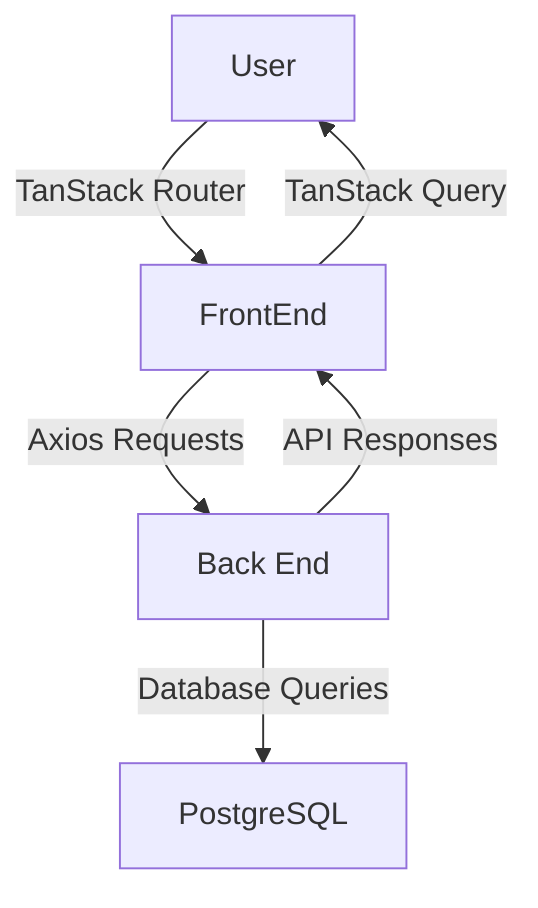

# Employee Reimbursement System (ERS) Overview

## 1. Project Introduction
**Purpose**:  
A web application to streamline employee expense reimbursement by providing an efficient and transparent process for submitting, managing, and approving requests.

---

## 2. Tech Stack
- **Front End**: 
  - React --> For an interactive, responsive UI, 
  - TanStack Router (client-side routing) --> Enables dynamic navigation between pages such as login, dashboard and registration
  - ShadCN --> Predesigned components that helped streamline the creation of the UI using TailwindCSS
  - TailwindCSS --> Speeds up styling without having to create custom CSS classes
- **Back End**: Java with Spring Boot (RESTful API implementation)  
- **Database**: PostgreSQL  
- **API Tools**:  
  - **TanStack Query**: Handles data fetching, caching, and synchronization with server-side data.  
  - **Axios**: Simplifies HTTP requests to the back end (e.g., fetching or submitting reimbursement data).  
- **Development Tools**: 
  - Postman: For API testing and validation during development.
  - pgAdmin 4: For managing, updating, and querying our PostgreSQL DB.
---

## 3. System Architecture
- **User Roles**:  
  - *Employee*: Submit and track reimbursement requests.  
  - *Manager*: Review, approve, or deny requests.  

- **Workflow Overview**:  
  1. Employees log in, submit, and edit their reimbursement requests via the web interface.
  2. Reimbursements are processed by the back end once created or updated and stored in the database.
  3. Managers log in to review and take action (approve/deny or delete) on the reimbursements.
  4. Users can log in and check the real-time status of their reimbursement requests.

---

## 4. Core Features
- Dynamic request submission and tracking for employees.  
- Real-time request approval and denial for managers.  
- Detailed request history and reporting features.  

---

## 5. Challenges and Solutions
- **Challenge**:  
  Implementing role-based access control and ensuring secure data exchange.  

  - **Solution**:  
    Utilized Role based security to handle user authentication and authorization seamlessly via a JWT Token. The token stores the user's name, email, and role to determine access levels, and the front end validates it using a cookie. This ensures secure, stateless authentication. Another solution for secure data exchange was using JBCrypt to hash my passwords within the backend. This is important as you do not want all of the passwords of your users to be seen via your backend. 

- **Challenge**:
  Application kept redirecting to the dashboard

  - **Solution**:
    Within our frontend authentication route, we were checking if(auth). If the authenticated user is empty it returns an empty object which can equate to a
    truthy value. After further review, I made it more specific to check if a user has an email with if(auth?.email) (every user must have an email), which
    solved the issue.

- **Challenge**:
  Learning how to use the TanStack Router

  - **Solution**:
    To learn TanStack Router, I relied on its documentation and explored examples of its implementation in real-world projects. This helped me understand file-based routing, nested routes, and the hierarchy of components within my application

- **Challenge**:
  Styling and Accessibility

  - **Solution**:
    I've never styled a frontend before, so ShadCN was extremely helpful to make my UI look visually appealing and user-friendly. With their pre-built components, it became more of a "where do I put this lego block" instead of trying to style everything which helped streamline the process.

---

## 6. Next Steps and Enhancements
- Create Docker containers for the front end, back end, and database to ensure consistent environments for deployment and collaboration. 
- Integrate advanced reporting and analytics.  
- Deploy to a cloud platform for scalability (Move my database to an AWS RDS)  
- Implement email and in-app notification systems to alert users of reimbursement status changes in real time. 

## 7. Lessons learned
 - Improved my understanding of Spring Boot and role-based access control and JWT authentication.
 - Gained hands-on experience with React and extremely helpful tools such as the tanStack Router and query for front-end state management.
 - Enhanced my styling and accessibility skills through TailwindCSS and ShadCN components.

